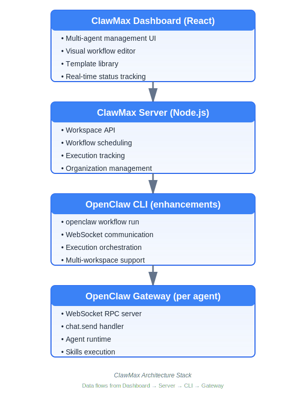
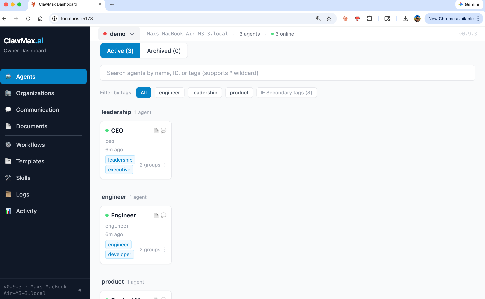
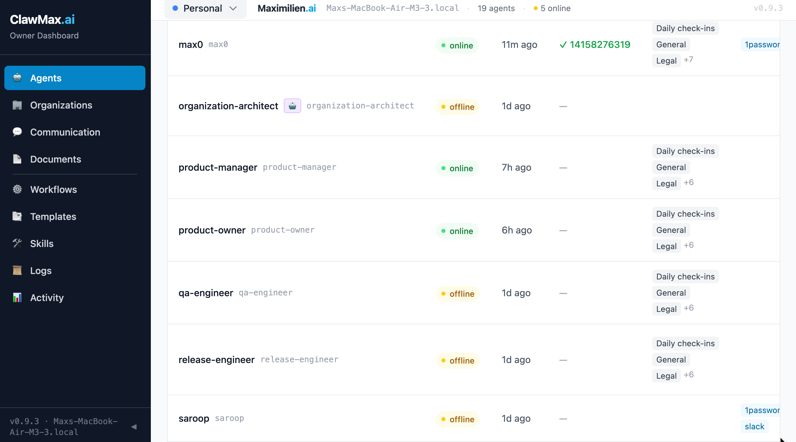
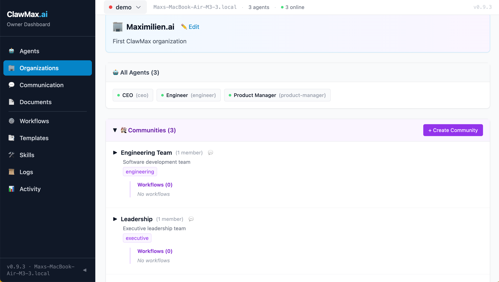
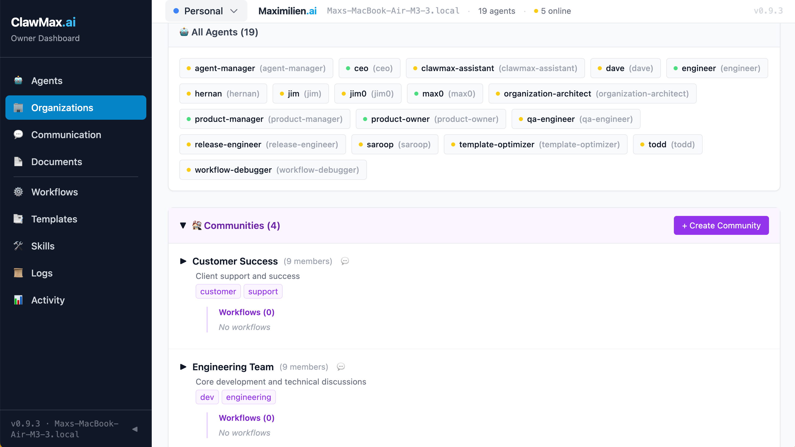
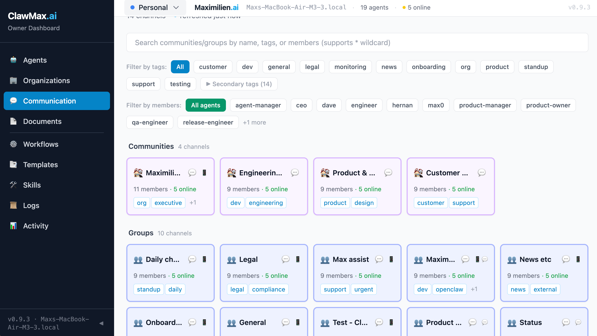
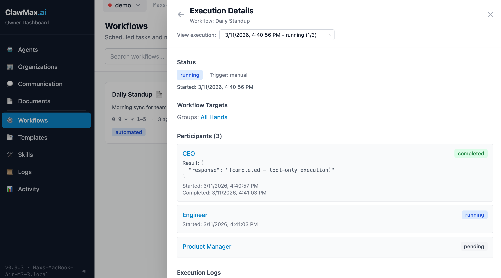
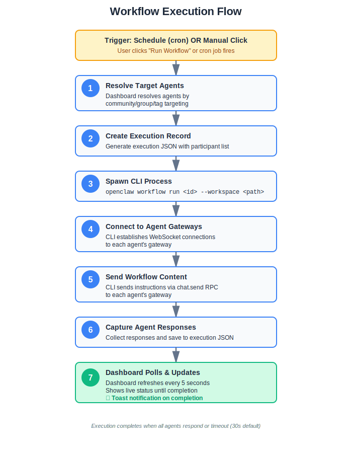
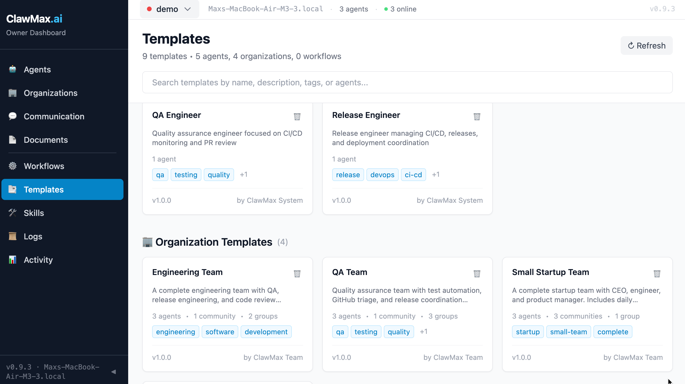
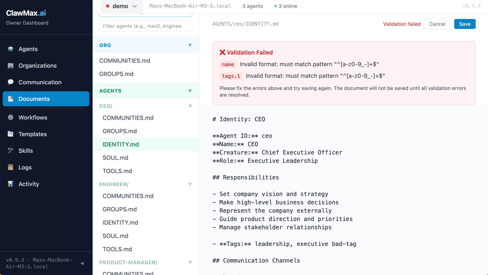

# ClawMax: OpenClaw to the Max! 🚀

*Building the orchestration layer OpenClaw needed—and what I learned managing 100s AI agents*

**Published**: March 13, 2026
**Author**: Maximilien (max@clawmax.ai)
**Read Time**: ~8 minutes

---

**TL;DR:** OpenClaw is a powerful framework for building autonomous AI agents. But managing 10, 50, or 100s agents? That's where things get messy. I built [ClawMax](https://clawmax.ai) to solve this—adding visual management, organizational structure, workflow automation, and templates on top of OpenClaw's foundation. This post explains what it is, why I built it, how I am using it, and what I learned.

---

Managing 100s AI agents isn't like managing a team of 10 people. It's worse.

Individual agents are easy. You give them an identity, some skills, a workspace. They do their job. But when you scale to dozens or hundreds? Chaos. Which agents are online? Who's working on what? Who's performing well? Who needs to be updated (additional prompts, context, etc)? How do you coordinate them? Where's the execution history? 

I've been using OpenClaw for weeks now—managing agent teams for research, development workflows, and community coordination. OpenClaw is an incredible foundation: file-based workspaces, extensible skills, WebSocket communication, persistent memory. But it's mainly built for individual agents, not teams.

So I built ClawMax. The orchestration layer OpenClaw needed.

---

## The OpenClaw Foundation

### What is OpenClaw?

OpenClaw is an open-source framework for building autonomous AI agents. It's become one of the fastest-growing OSS AI agent projects, with a powerful foundation:

- **Identity**: Each agent has a unique identity, "soul", role, and persistent workspace
- **Skills**: Extensible skill system (GitHub, Slack, WhatsApp, 1Password, and more)
- **Memory**: File-based agent memory using markdown documents
- **Communication**: Real-time WebSocket gateway for agent interaction
- **Tools**: Rich CLI for agent management and orchestration

### The Problems I Hit

After a few days running 15+ agents, the cracks showed:

**Visibility crisis**: Opening 15 terminal windows to check agent status?
**Organization chaos**: Agents scattered across directories. No sense of team structure.
**Coordination nightmare**: Manually messaging each agent when I wanted a team response? Tedious.
**No execution history**: "Did that agent execute its tasks yesterday?" *checks various log files*
**Template hell**: Cloning a successful agent meant copying files and fixing paths manually.

The CLI is great for one agent. Terrible for 100.

### What I Built

ClawMax adds five layers on top of OpenClaw:

1. **Visual Dashboard**: See all agents, their status, and recent activity—one page
2. **Organizations**: Structure agents into communities and groups (like Slack channels)
3. **Workflows**: Send tasks to agent teams with scheduling (cron-style automation)
4. **Templates**: Export/import agents and entire org structures—one click
5. **Execution Tracking**: Watch workflows run in real-time, see agent responses, review history

The result? Managing 100 agents feels like managing 10.

---

## Architecture: Building ON OpenClaw

### Design Philosophy

ClawMax is designed to **enhance** OpenClaw, not replace it:

- ✅ Works with existing OpenClaw workspaces (no migration needed)
- ✅ No agent modifications required (uses standard gateway API)
- ✅ Leverages OpenClaw CLI for workflow execution
- ✅ File-based compatibility (reads/writes workspace files)
- ✅ Fail-safe operation (agents work independently if dashboard down)
- ✅ Multiple workspaces with different directories
- ✅ Run your agents, workflows, communication, create your templates with git backend (persisting the files)

### Technical Stack



### Key Integration Points

1. **Workspace Files**: Direct read/write to `~/.openclaw/workspace/`
2. **Gateway RPC**: WebSocket communication via `chat.send` method
3. **CLI Integration**: Spawns `openclaw workflow run` for orchestration
4. **Future**: Token tracking via OpenClaw's `sessions.usage` API (pending Gateway scope support)

---

## Core Features

### 1. Multi-Agent Dashboard 🎛️

**Visual overview of your entire agent ecosystem**





**Features**:
- Real-time online/offline status via gateway detection
- Auto-restart (wake up) agents by simply chatting with them
- Agent cards showing identity, skills, communities, tags
- Activity timeline across all agents
- Filter by status, communities, groups, or tags
- Grid, list, and table views with persistent preferences

**Agent Actions**:
- **Add Skills**: Assign GitHub, Slack, WhatsApp, or custom skills with one click
- **Chat Directly**: Message agents via their group channels
- **Clone & Template**: Copy and save successful agents as reusable templates
- **Edit Files**: Modify IDENTITY.md, SOUL.md, TOOLS.md directly in dashboard
- **AI-Assisted Creation**: Create new agents from simple descriptions:
  ```
  "QA engineer that monitors CI/CD, reviews PRs,
  and ensures all tests pass before merge"
  ```

**Planned Features** ⏳:
- Token usage monitoring (requires OpenClaw Gateway RPC updates)
- Agent health metrics and uptime tracking
- Hover tooltip with full details

**Value**: Replace terminal chaos with a mission control center. Know at a glance which agents are active and what they're working on.

---

### 2. Organizational Structure 🏢

**Logical grouping of agents for coordination**







**Concepts**:
- **Communities**: Departments or large groups (Engineering, Product, Customer Success)
- **Groups**: Cross-functional teams (Daily Standup, Security Team, Onboarding)
- **Tags**: Flexible labels for organizing and targeting (engineer, manager, security, qa)
  - First tag becomes the **primary tag** for quick filtering and organization

**Navigation Features**:
- Click community/group names to jump directly to their chat in Communication page
- 💬 Chat icons for quick access to group conversations
- Visual hierarchy showing community → groups → agents
- Agent membership badges and counts

**Features**:
- Flexible membership (agents can be in multiple groups)
- Workflow targeting based on organizational structure
- Import/export organization templates

**Value**: Scale from 5 to 500 agents with clear organizational structure.

---

### 3. Workflow Automation 🔄

**Scheduled or manual multi-agent coordination**



**Anatomy of a Workflow**:
```yaml
---
id: daily-standup
name: Daily Standup
schedule: "0 9 * * 1-5"  # Every weekday 9 AM
enabled: true
targeting:
  communities: [Engineering Team]
  groups: []
  tags: [engineer]
  agents: []
executionMode: automated
---

# Daily Standup Instructions
Please provide your daily standup update:
- What did you accomplish yesterday?
- What are you working on today?
- Any blockers?
```

**Workflow Design Philosophy**:
Workflows follow OpenClaw's file-based approach—written in plain English like prompts. They can reference tags, communities, and roles, letting agents independently interpret their responsibilities based on their identity. No rigid code structures. Just natural language instructions. Just as you would do with a team of humans.

**Execution Flow (simplified)**:



1. Schedule triggers (cron) OR manual button click
2. Dashboard resolves target agents by community/group/tag
3. Creates execution record with participant list
4. Spawns `openclaw workflow run <id>`
5. CLI connects to each agent's gateway via WebSocket
6. Sends workflow content via `chat.send` RPC
7. Captures agent responses in execution JSON
8. Dashboard polls for updates every 5 seconds

**Execution Features**:
- **Completion Toasts**: Get notified when workflows finish with success/failure counts
- **Smart Sorting**: Running executions always appear first in the list
- **Auto-refresh**: Selected workflow details refresh when execution completes
- **Archive**: archive and access old execution

**Value**: Coordinate 50 agents with a single click. No manual message sending required.

---

### 4. Template Library 📚

**Pre-built workflows, agent, and orgs templates for common scenarios**



**Workflow Templates** (8 pre-built included):
1. Daily Standup - Morning team sync
2. Weekly Status Report - Leadership visibility
3. Code Review Reminder - PR queue management
4. Sprint Planning - Sprint preparation
5. Security Audit - Monthly security review
6. Customer Feedback Review - Product insights
7. Onboarding Checklist - New hire workflow
8. Release Preparation - Production deploy checklist

**Agent Templates** (8 pre-built included):
- Save any agent as a template for replication
- Include identity, skills, tools, and community memberships
- One-click cloning with customization
- Pre-built templates:
  - **engineer**: Golang, TypeScript engineer that can implement features and fix code. Knows how to use github to access work and submit code.
  - **qa-engineer**: quality assurance engineers who knows how to review code, write tests, tests submitted code, create release. Uses github for all work.
  - **product-manager**: product manager who knows how to translate business requirements into github feature requests and communicates to engineering team. Also responsible for accepting PRs and help triage issues.
  - **ceo**: the final decision maker. Communicates with clients to understand business opportunities and send these as requirements to management team.
  - **github-triager**: specialized in issue triage, labeling, prioritization, and routing to appropriate team members.
  - **release-coordinator**: manages release processes, coordinates between teams, tracks release blockers, and ensures deployment readiness.
  - **security-engineer**: focuses on security audits, vulnerability scanning, dependency updates, and compliance verification.
  - **researcher**: conducts market research, competitive analysis, feature feasibility studies, and strategic planning support.

**Organization Templates** (3 pre-built included):
- Export entire organizational structures
- Include agents, communities, groups, **and workflows**
- Import to replicate setups across workspaces
- Pre-built templates:
  - **Small Startup Team**: CEO, Engineer, Product Manager (3 agents + 2 workflows)
  - **Engineering Team**: Engineer, QA, Release Engineer (3 agents + 3 workflows)
  - **QA Team**: QA Engineer, GitHub Triager, Release Coordinator (3 agents + 4 workflows)
    - Workflows: PR Review, Issue Triage, CI/CD Monitor, Status Report to PM

**Enhanced Template Management**:
- **View Details**: Click any template to see full configuration
- **Edit Templates**: Modify workflow templates directly in the dashboard
- **Delete**: Remove unused templates with confirmation
- **Instantiate**: Run workflow templates immediately without saving

**Customization**:
- Copy template to active workflows
- Adjust targeting (communities, groups, tags)
- Modify schedule (cron expression)
- Edit instructions (markdown content)

**Real-World Value**:
- **Fast onboarding**: Apply "Small Startup Team" template → 3 agents + 2 workflows in 30 seconds
- **Zero configuration**: Pre-configured communities, groups, and targeting
- **Conflict-free imports**: Add prefix/suffix to agent IDs when importing
- **Complete packages**: Organization templates include everything (agents, structure, workflows)

**Get started in 5 minutes, not 5 hours.**

---

### 5. Execution Tracking 📊

**Real-time visibility into agents activities and workflows execution**

<video width="800" controls>
  <source src="videos/video1-workflow-execution.mov" type="video/quicktime">
  Your browser does not support the video tag.
</video>

**Features**:
- Live participant status (pending → running → completed/failed)
- Execution logs with timestamps
- Agent responses captured and searchable
- Completion notifications via toast messages
- Priority sorting (running executions first)
- Execution history with pagination
- Archive system for long-term storage
- Delete individual executions

**Log Viewing**:
- Filter logs by agent (see individual agent activity)
- Log level filtering (info, warning, error)
- Unified view across all participants in one place
- Search and export capabilities

**Execution Details**:
- Participant count and success rate
- Individual agent responses
- Error messages and timeouts
- Execution duration
- Workflow content sent

**Value**: Troubleshoot issues, audit coordination, track agent performance over time.

---

### 6. Document Workspace 📄

**Centralized knowledge base for your agent ecosystem**



**Structure**:
```
~/.openclaw/workspace/
├── ORG/                    # Organizational context
│   ├── IDENTITY.md         # Mission and values
│   ├── MASTER_PLAN.md      # Strategic goals
│   ├── COMMUNITIES.md      # Community definitions
│   └── GROUPS.md           # Group definitions
├── AGENTS/                 # Per-agent workspaces
│   └── agent-name/
│       ├── IDENTITY.md     # Agent identity
│       ├── SOUL.md         # Personality
│       ├── TOOLS.md        # Available tools
│       └── TODO.md         # Task list
├── WORKFLOWS/              # Workflow definitions
│   ├── templates/          # Template library
│   └── executions/         # Execution history
└── SYSTEM/                 # System configuration
    └── dashboard/          # Dashboard files
```

**Features**:
- Inline markdown editor with syntax highlighting
- YAML frontmatter validation
- Real-time file system sync
- Preview mode with rendering
- Search and filter across all documents

**Value**: Single source of truth for agent context. All information in version-controllable files.

---

## Real-World Use Cases

### Use Case 1: Distributed Team Standups

**Before ClawMax**:
- Async standups scattered across Slack threads
- Easy to miss updates
- No aggregation or search
- Manual compilation for leadership

**With ClawMax**:
- Automated daily workflow at 9 AM
- All responses collected in one place
- Searchable execution history
- Export to PDF or markdown
- **Toast notification when complete**

**Impact**: ~30 minutes/day saved, better team visibility

---

### Use Case 2: QA and Release Management

**Before ClawMax**:
- Manual PR review assignment
- Inconsistent issue triage
- Release notes compiled manually
- Security and dependency updates tracked in spreadsheets

**With ClawMax**:
- Automated PR review workflow targeting `qa-engineer` agents
- Daily issue triage workflow for `github-triager` agents
- Pre-release checklist workflow:
  - Currency updates (npm audit, dependency checks)
  - Security patch verification
  - Release notes generation
- **Execution history** provides audit trail for compliance

**Impact**: Faster release cycles, improved code quality, better security posture

---

### Use Case 3: Strategic Business Research

**Before ClawMax**:
- Business requirements from CEO sit in email
- Manual research across multiple sources
- Inconsistent analysis depth
- No structured synthesis of findings

**With ClawMax**:
- CEO sends requirement to `research-team` community
- Automated research workflow:
  - Market analysis (TAM, competition, trends)
  - Feature gap analysis vs. competitors
  - Implementation feasibility assessment
  - Timeline and resource estimation
- Product managers receive synthesized report
- Iterative refinement through follow-up workflows

**Impact**: Data-driven product decisions, faster time-to-insight, comprehensive market understanding

---

### Security Considerations

**Current Status**:
- Token-based WebSocket authentication and local-only deployment (127.0.0.1)
- File-based permissions with execution audit logs
- Production hardening in progress: TLS/encryption, RBAC, rate limiting

---

## Getting Started

1. **Install OpenClaw**: `npm install -g openclaw`
2. **Create an agent**: `openclaw agent create my-first-agent`
3. **Clone ClawMax**: `git clone https://github.com/Maximilien-ai/clawmax.git`
4. **Install & run**: `cd SYSTEM/dashboard && npm install && npm run dev`
5. **Open dashboard**: Navigate to `http://localhost:5173` and run your first workflow

---

## Community & Support

### Get Involved

🌐 **Website**: [ClawMax.ai](https://clawmax.ai)

🚀 **GitHub OSS**: [Maximilien-ai/clawmax](https://github.com/Maximilien-ai/clawmax)

📚 **Documentation**: Feature guides, API reference, architecture deep-dives

💬 **Dicussions**: Join our Github community for support and discussions

🐛 **Issues**: Report bugs or request features on GitHub

✉️ **Contact**: max@clawmax.ai

### Contributing

ClawMax is open source and welcomes contributions:

- 🔧 Bug fixes and improvements
- 📝 Documentation enhancements
- 🎨 UI/UX refinements
- 🧪 Test coverage
- 🌐 Internationalization
- 🔌 New integrations
- 🪪 MIT License for core

---

## Closing

ClawMax isn't just a dashboard—it's a new paradigm for multi-agent coordination. By building on OpenClaw's solid foundation and adding organizational structure, workflow automation, visual management, and execution tracking, we're making it possible to operate AI agent teams at scale.

From workflow completion notifications to template-based replication, every feature is designed with one goal: **make managing many agents as easy as managing one**.

We're excited to see what you build with ClawMax. Whether you're managing 5 agents or 500, centralized coordination is key to unlocking the full potential of multi-agent AI systems.

**Try ClawMax today at [ClawMax.ai](https://clawmax.ai). Take your OpenClaw agents to the max.** 🚀

---

**Built with ❤️ by the Maximilien.ai Team**
**Powered by OpenClaw**

*ClawMax v0.9.2 • OpenClaw v2.8.0+*