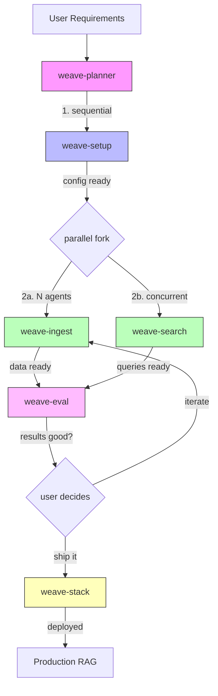

# OpenClaw Hack Day — March 25, 2026

> **Event:** [The Agent Toolkit — OpenClaw Hack Day w/ OpenAI Codex](https://luma.com/openclaw-hack-day-mar25-2026?tk=yAFIM0)
> **Goal:** Create weave-cli skills for OpenClaw + publish to SkillsHub + ClawMax "RAG Team" template
> **Branch:** `hackathon/openclaw-hack-day-mar25`
> **Deadline:** EOD March 25 (working MVP before 1pm, iterate until deadline)

## Strategy

Build OpenClaw skills that make any agent a weave-cli expert — able to plan, build, and operate multimodal RAG solutions end-to-end. Package as a ClawMax "RAG Team" template with parallel agent workflows.

**Key repos:**
- `clawmax` — dashboard, skills, templates
- `weave-cli` — the RAG CLI being skilled
- `auctionsmax-ai` — reference implementation to model after

## Skill Architecture

Split weave-cli capabilities into **5 focused skills** so agents can specialize and run in parallel:

| # | Skill ID | Scope | Parallel? |
|---|----------|-------|-----------|
| 1 | `weave-setup` | Install, config, doctor, .env, VDB selection | Sequential (first) |
| 2 | `weave-ingest` | Collections, schemas, chunking, pipeline ingest, backup | Yes |
| 3 | `weave-search` | Queries, agents (RAG/QA/summarize), search tuning | Yes |
| 4 | `weave-eval` | Datasets, evaluators, benchmarks, result analysis | Yes (after ingest) |
| 5 | `weave-stack` | Stack init/up/down, k8s/podman, dashboard, day-2 ops | Yes |

Plus one **orchestrator skill:**

| # | Skill ID | Scope |
|---|----------|-------|
| 6 | `weave-planner` | End-to-end RAG lifecycle planning, agent coordination, user requirements gathering |

**Publishing:** All skills published to [SkillsHub (weave-cli-skills)](https://github.com/Maximilien-ai/weave-cli-skills) for community use.

### Skill Interconnection & Parallelism



**Scaling rules:**
- `weave-setup` — 1 agent, sequential gate (runs first)
- `weave-ingest` — **N agents** in parallel (split by document batches)
- `weave-search` — **N agents** in parallel (concurrent with ingest after first batch)
- `weave-eval` — **N agents** in parallel (after ingest completes)
- `weave-stack` — 1 agent, sequential gate (runs last)
- `weave-planner` — 1 agent, orchestrates full lifecycle

## RAG Team Template

Maps to ClawMax concepts:

```
Community: "RAG Team"
  Group: "Planning"     — planner agent (weave-planner + weave-setup)
  Group: "Data"         — ingest agents (weave-ingest)
  Group: "Search & QA"  — search agents (weave-search)
  Group: "Quality"      — eval agents (weave-eval)
  Group: "Ops"          — stack/infra agents (weave-stack)

Workflows:
  1. "RAG Setup"        — sequential: planner gathers reqs → setup agent configures
  2. "Data Pipeline"    — parallel: N ingest agents process documents
  3. "Search Tuning"    — parallel with ingest: search agents test queries
  4. "Eval Cycle"       — after ingest: eval agents run benchmarks
  5. "Deploy"           — sequential: stack agent stands up infra
  6. "Iterate"          — loop: eval results → tuning → re-eval
```

## Timeline — MVP-First Approach

### Phase 1: Core Skills (target: 11:30am) — MUST HAVE

- [x] **1a. Create skill scaffolding** — 6 skill directories with SKILL.md
- [x] **1b. `weave-setup` skill** — full SKILL.md with weave doctor, config create, .env, VDB selection guidance
- [x] **1c. `weave-ingest` skill** — collection create, schema suggest, chunking suggest, pipeline ingest, backup
- [x] **1d. `weave-search` skill** — query, agents create/use, RAG/QA/summarize patterns
- [x] **1e. `weave-eval` skill** — datasets, evaluators, eval run, benchmark, result interpretation
- [x] **1f. `weave-stack` skill** — stack init/up/down/status, dashboard, day-2 ops
- [x] **1g. `weave-planner` skill** — lifecycle orchestration, requirements gathering, plan generation

### Phase 2: RAG Team Template (target: 12:30pm) — MUST HAVE

- [x] **2a. Template JSON** — agents, communities, groups, workflows, parameters
- [x] **2b. Agent IDENTITY/SOUL/TOOLS** — for each role (planner, data, search, eval, ops)
- [x] **2c. Workflow definitions** — setup, ingest, search, eval, deploy, iterate
- [x] **2d. Register template** — added to TEMPLATES/organizations/rag-team, 6 skills imported to workspace

### Phase 3: MVP Test (target: 1:00pm) — MUST HAVE

- [x] **3a. Deploy small RAG team** — applied template, 6 agents online, 6 workflows, skills wired
- [x] **3d. Fix blockers** — fixed: targeting.agents undefined, manual schedule, cross-workspace messages, undefined tags, workflow targeting normalization, agent name expansion, skill emoji/tags parsing
- [ ] **3b. Simple test case** — use auctionsmax-ai sample PDFs, 1 collection, basic eval
- [ ] **3c. Verify e2e** — setup → ingest → search → eval → results

### Phase 4: Scale & Polish (target: 3:00pm) — SHOULD HAVE

- [ ] **4a. Scale test** — 2nd RAG team instance with more agents per role
- [ ] **4b. Parallel workflows** — verify N ingest agents process data concurrently
- [ ] **4c. Deeper evals** — multi-collection, multimodal, LLM judge
- [ ] **4d. Day-2 ops** — backup, scaling guidance, security

### Phase 5: Publish & Present (target: 5:00pm) — SHOULD HAVE

- [ ] **5a. Publish skills to SkillsHub** — package and submit
- [ ] **5b. Publish template to ClawMax** — tag release
- [ ] **5c. Demo prep** — short demo script showing RAG team in action
- [ ] **5d. Presentation** — slides or live demo walkthrough

### Stretch Goals (if ahead of schedule)

- [ ] **S1. MCP integration** — weave MCP server as skill tool
- [ ] **S2. Embedding comparison workflow** — OSS vs OpenAI auto-benchmark
- [ ] **S3. Cost estimation** — predict ingest/query costs before running
- [ ] **S4. Template wizard** — generate RAG team from natural language description
- [ ] **S5. Cross-VDB migration** — backup from one VDB, restore to another

## Skill Content Reference

### weave-cli Command Map → Skills

| Command | Skill |
|---------|-------|
| `weave doctor`, `weave config *`, `weave vdb *`, `weave health` | weave-setup |
| `weave collection create/list/show/delete`, `weave document *`, `weave pipeline ingest`, `weave schema suggest`, `weave chunking suggest`, `weave backup *` | weave-ingest |
| `weave collection query`, `weave query`, `weave agents *`, `weave collection re-embed/compare` | weave-search |
| `weave eval *`, `weave embeddings list` | weave-eval |
| `weave stack *`, `weave serve`, `weave mcp *` | weave-stack |

### Supported VDBs (10)
Weaviate, Qdrant, Milvus, Chroma, Supabase, Neo4j, MongoDB Atlas, Pinecone, Elasticsearch, OpenSearch

### Embedding Models
- OpenAI: text-embedding-3-small (1536d), text-embedding-3-large (3072d)
- OSS: sentence-transformers/all-mpnet-base-v2 (768d), all-MiniLM-L6-v2 (384d)
- Ollama: nomic-embed-text (768d), mxbai-embed-large (1024d)

### Agent Types (weave-cli built-in)
- RAG (general, temp 0.7)
- QA (precise, temp 0.3, strict mode)
- Summarize (temp 0.5, markdown output)
- Custom (user-defined)

## Reference Implementation: auctionsmax-ai

Pattern to follow:
```
config.yaml    → VDB config (Milvus default, collections defined)
.env           → API keys (OPENAI_API_KEY, MILVUS_LOCAL_ADDRESS)
weave-stack.yaml → k8s stack with MinIO for images
weave-agents.yaml → Agent configurations
data/          → Source documents (PDFs)
evals/datasets/ → YAML test cases (5 basic, 3 multimodal, 5 image)
tools/         → Shell scripts organized by concern
frontend/      → Express + Socket.IO search UI
```

## Risk Mitigation

| Risk | Mitigation |
|------|------------|
| Skills too broad, agents confused | Split into 5 focused skills with clear boundaries |
| weave-cli not installed on test agents | weave-setup skill includes install steps + doctor check |
| No VDB running locally | Use mock VDB for testing, or Weaviate Cloud (free tier) |
| Template too complex for testing | Start with 1-agent-per-role MVP, scale later |
| Time crunch | Phase 1-3 are MVP, Phase 4-5 are bonus. Ship working small over broken big. |

## Success Criteria

1. **Minimum:** 5 skills created and importable in ClawMax, at least 1 agent can use them
2. **Target:** RAG Team template deployed, small e2e test passing
3. **Stretch:** Scaled team, published to SkillsHub, demo-ready
